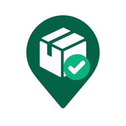

<div align="center">
  

  <h1>TrackerPal</h1>

  <p><strong>Modern emerald-green package tracking in Chrome, with optional private Gmail and Google Sheets workflows.</strong></p>

  <p>
    <a href="https://github.com/Excellonline/tracker-pal/actions/workflows/ci.yml"></a>
    =22" src="https://img.shields.io/badge/node-%3E%3D22-339933">
    
  </p>
</div>

## Overview

TrackerPal is a package tracker with two complementary modes. The Chrome extension keeps a fast, private delivery list in the browser side panel. The optional personal Google Apps Script workflow can scan Gmail, deduplicate shipment updates, write them into Google Sheets, and send a daily summary.

No TrackerPal backend is required. Local extension entries stay in the Chrome profile; the optional Google workflow stays in the owner's Gmail, Google Sheet, and Apps Script project.

## Highlights

- Native Chrome side-panel tracker with automatic UPS, USPS, FedEx, and DHL recognition plus optional-address pickup entries.
- Local package storage, newest-first editable entry dates, one-click carrier links, status controls, and received-package history.
- Minimal Chrome permissions: side panel and storage only, with no website access.
- Gmail scanner for order confirmations, shipment notices, delivery updates, delays, and exceptions.
- Google Sheets dashboard with open items, overdue packages, due-today packages, delivered-but-unchecked items, and missing ETA alerts.
- Manual `Received` checkbox so delivered emails do not automatically mark a package as physically received.
- Manual entry workflow for orders that do not arrive through the tracked Gmail account.
- Optional web UI variants for a cleaner TrackerPal front end.
- Local Node.js tests covering parsing, Gmail import behavior, summaries, Apps Script smoke checks, and Sheets logic.

## Chrome Extension

The personal unpacked build is created in `Desktop\TrackerPal Chrome Extension`:

```powershell
npm run build:extension
```

Open `chrome://extensions`, enable **Developer mode**, choose **Load unpacked**, and select that Desktop folder. Click the TrackerPal icon to open the side panel.

The public Chrome Web Store build is deliberately local-only so friends can use it without Google Apps Script access or Gmail permissions:

```powershell
npm run build:store
```

## Development

Install dependencies:

```powershell
npm install
```

Run the local test suite:

```powershell
npm test
```

Log in to Google Apps Script tooling:

```powershell
npm run login
```

Enable the Apps Script API at <https://script.google.com/home/usersettings>, then create or connect an Apps Script project:

```powershell
npm run create
npm run push
npm run open
```

For an existing Apps Script project, create a local `.clasp.json` from `.clasp.example.json`, fill in your project IDs, and keep that file private. `.clasp.json` is intentionally ignored by git.

## First Run

In the Apps Script editor, run these functions in order:

1. `setupOrderTracker`
2. `installTriggers`
3. `backfillOrders`
4. `healthCheck`

Google will ask for Gmail, Sheets, trigger, and email-send permissions during first setup. Because TrackerPal is a private Apps Script app rather than a published Marketplace app, Google may show an unverified-app warning for the owner account.

## Project Layout

| Path | Purpose |
| --- | --- |
| `trackerpal-extension/` | Manifest V3 Chrome side-panel extension and Store-safe local tracker. |
| `src/` | Main Apps Script source for Gmail scanning, parsing, Sheets setup, dashboarding, and web UI. |
| `tests/` | Node.js tests for parser behavior, Apps Script loading, Gmail workflows, summaries, and Sheets updates. |
| `assets/` | Brand assets and icons used by the README and UI variants. |
| `trackerpal-bound-ui/` | Bound UI version for opening TrackerPal from the Sheet context. |
| `trackerpal-desktop/` | Desktop-oriented Apps Script web app variant. |
| `trackerpal-sheet-ui/` | Sheet UI manifest variant. |
| `docs/` | Architecture and deployment notes. |

## Configuration

TrackerPal creates a `Settings` tab automatically. Common settings include:

| Setting | Purpose |
| --- | --- |
| `scan_days` | How far back the hourly sync scans. |
| `backfill_days` | How far back `backfillOrders` scans. |
| `timezone` | Defaults to `America/New_York`. |
| `summary_enabled` | Enables or disables daily summaries. |
| `summary_recipient` | Email recipient for daily summaries. |
| `summary_hour` | Hour of day for the daily summary trigger. |
| `max_threads_per_query` | Gmail thread cap per search query. |

If `summary_recipient` is blank, hourly sync still runs but the daily summary trigger is skipped.

## Manual Orders

Use `Order Tracker > Add manual order` for a quick one-off entry, or fill in the `Manual Entry` sheet and run `Order Tracker > Import manual entry`.

From Gmail, apply the label `TrackerPal` to force-import a low-signal message that the normal scanner would skip. The hourly sync checks that label for recent messages and imports them through the same dedupe path.

## Documentation

- [Deployment Guide](docs/DEPLOYMENT.md)
- [Architecture Notes](docs/ARCHITECTURE.md)
- [Contributing Guide](CONTRIBUTING.md)
- [Security Policy](SECURITY.md)
- [Privacy Policy](docs/PRIVACY.md)
- [Support](docs/SUPPORT.md)
- [Chrome Web Store Submission](docs/CHROME_WEB_STORE.md)
- [Changelog](CHANGELOG.md)

## Privacy

TrackerPal has no analytics, advertising, or developer-owned data service. Extension entries stay in Chrome. Clicking a package's carrier pill opens the chosen carrier's website and therefore sends that tracking number to the carrier. Gmail messages used by the optional personal workflow are processed inside the owner's Apps Script project and stored in the owner's Google Sheet.

Keep deployment URLs, secret keys, `.clasp.json`, `.clasprc.json`, and Google project IDs out of commits, issues, screenshots, and public docs.

## License

No open-source license has been published for this repository. Contact the repository owner before copying, modifying, or redistributing the project.
