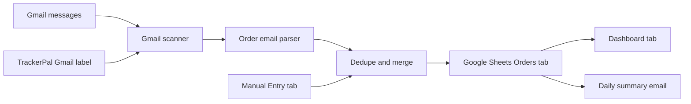

# Architecture Notes

TrackerPal is a Google Apps Script application with a Google Sheet as the durable data store.

## Data Flow



## Main Components

| Component | Files | Responsibility |
| --- | --- | --- |
| App bootstrap | `src/Code.js`, `src/OrderTrackerApp.js` | Menu setup, setup helpers, trigger entry points, and shared orchestration. |
| Configuration | `src/Config.js` | Defaults, setting names, status values, carrier metadata, and column definitions. |
| Email parsing | `src/OrderEmailParser.js` | Extracts store, item, order number, carrier, tracking number, ETA, and status from email content. |
| Gmail integration | `src/OrderTrackerGmail.js` | Searches Gmail, reads messages, handles labels, and imports candidate emails. |
| Dedupe | `src/OrderTrackerDedupe.js` | Merges updates by tracking number, order number, message ID, or generated manual ID. |
| Sheets integration | `src/OrderTrackerSheets.js` | Creates tabs, headers, validations, formatting, dashboard formulas, and order row updates. |
| Manual orders | `src/OrderTrackerManual.js` | Supports prompt-based entry and Manual Entry sheet import. |
| Summaries | `src/OrderTrackerSummary.js` | Builds and sends daily status emails. |
| Web UI | `src/OrderTrackerWeb.js`, `src/TrackerPal.html` | Serves the TrackerPal interface for supported deployments. |

## Dedupe Strategy

TrackerPal prefers stable package identifiers:

1. Tracking number
2. Store plus order number
3. Gmail message ID
4. Generated manual entry ID

When multiple updates describe the same package, newer useful data can fill missing fields while manual notes and the `Received` checkbox are preserved.

## Testing Strategy

Tests are plain Node.js scripts under `tests/` and can be run with:

```powershell
npm test
```

Coverage focuses on:

- Manifest and scope expectations
- Parser behavior across common carrier and retailer emails
- Gmail scanning and label import behavior
- Summary prioritization
- Apps Script source loading with stubs
- Sheets setup, upsert, dedupe, manual entry, and note preservation
